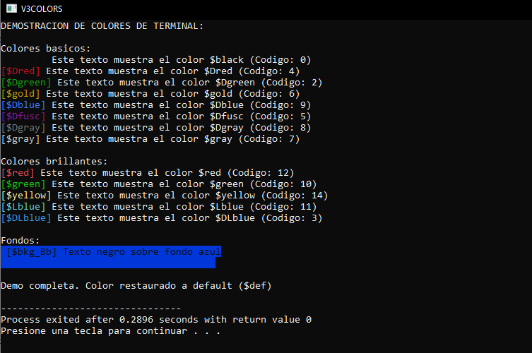

# V3Colors - Biblioteca de Colores para Consola Windows / Windows Console Color Library



## Descripción | Description 📄

Biblioteca de cabecera para C++ que permite cambiar los colores del texto y fondo en terminal de Windows. / Header-only library for C++ to change text and background colors in Windows console.

## Características / Features ✨

- 🎨 15 colores predefinidos / 15 predefined colors
- 💻 Soporte para texto y fondo / Text and background support
- 🚀 Función de demostración incluida / Built-in demo function
- ⚡ Integración sencilla / Easy integration
- 📦 Ligero (solo requiere windows.h) / Lightweight (only requires windows.h)

## Instalación / Installation ⚙️

1. Descarga `v3colors.h` / Download `v3colors.h`
2. Colócalo en tu proyecto / Place it in your project
3. Inclúyelo / Include it

```cpp
#include "v3colors.h"
```
